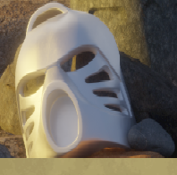
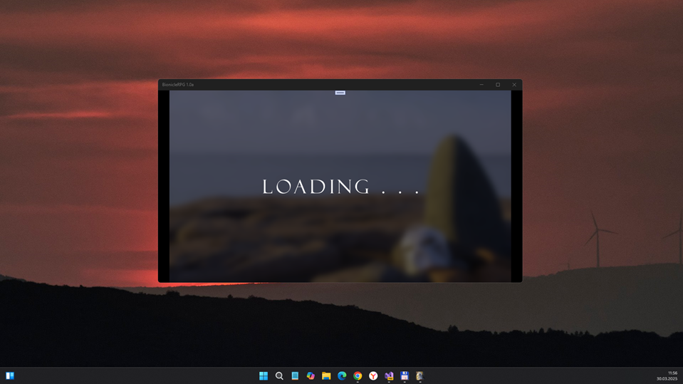
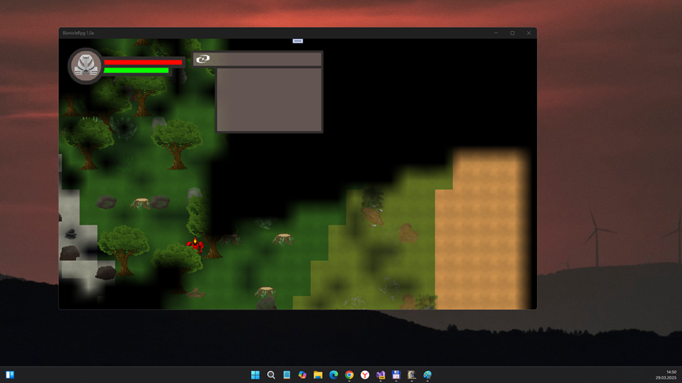
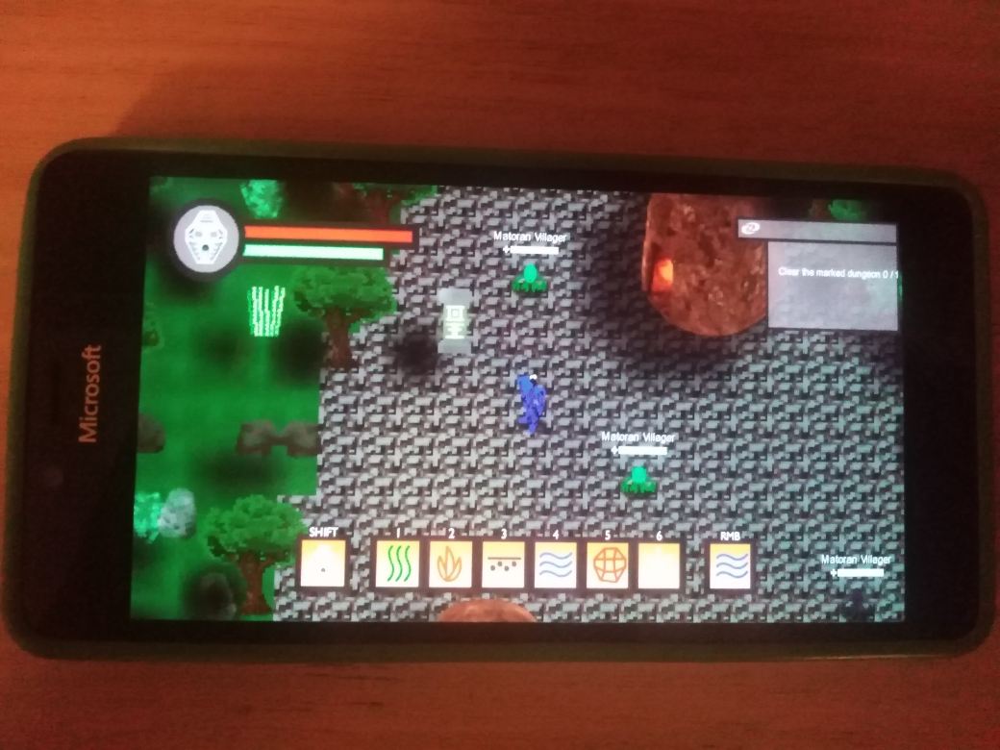

# BionicleRPG 1.0-alpha - main branch 

## About 
" BIONICLE: Destiny of the Toa is a 2D top-down RPG with procedurally generated islands and dungeons. Experience the infinite possibilities when it comes to world exploration, start a new game, and get a new world every time, or save the game to reload and explore your absolute favorite world again and again.

Use mask powers to find new ways to explore the world around you. Visit all the different biomes, either by yourself or use the map if you ever get lost.

Help the Matoran villagers by accepting quests. Venture out into the world to gather materials, clear dungeons or defeat enemies." 

## My 2 cents
- UI little bugs (Mask shownig, etc.) fixed at now :)
- Pathfinder repaired via AI in MS Copilot (thanks to VS 2022 Preview))
- Player movements fixed
- Near weapon (left button click) activated
- Semi-god mode explored (I detected player's death not realized by original dev team, hehe)
- Screen scaling is ok for now (but GameLoad mode damaged... some errors persist when forming buttons-screens)
- Touch-friendly UI inited (on-screen buttons + touchpanel "taps")

## Controls
- WASD: Move
- LMB: Normal attack
- RMB: Elemental attack
- Left Shift: Mask power
- 1-6: Change character / mask (idk yet whats up... find the names of mask modes in src code)))
- M: Map (Up key- increase map scale, Down key - decrease scale)
- F: Interact

## Screenshots

## Tech details
- Early bird. I plan to use this thing as template ("sketch") to simplify some adventure game dev in future:)
- UWP app : Min Win. SDK is 10240, Main Win. SDK is 19041  

## ToDo
- Realize some more complex game process ;)
- Fix 100500 bugs after dirty R.E. (constructors, items, sting builders, etc.)
- Fix touch-friendly UI (map interaction, and "LShift" emulation needed!)

## Reference(s)
- https://ripofirm.itch.io/bionicle-destiny-of-the-toa Original "Bionicle Destiny of the Toa" project
- https://www.youtube.com/watch?v=oL-UjJF-JFA Bionicle Destiny of the Toa - Gameplay Trailer (1 min.)

## .
As is. No support. DIY. Learn purposes only.

## ..
[m][e] March 2025

