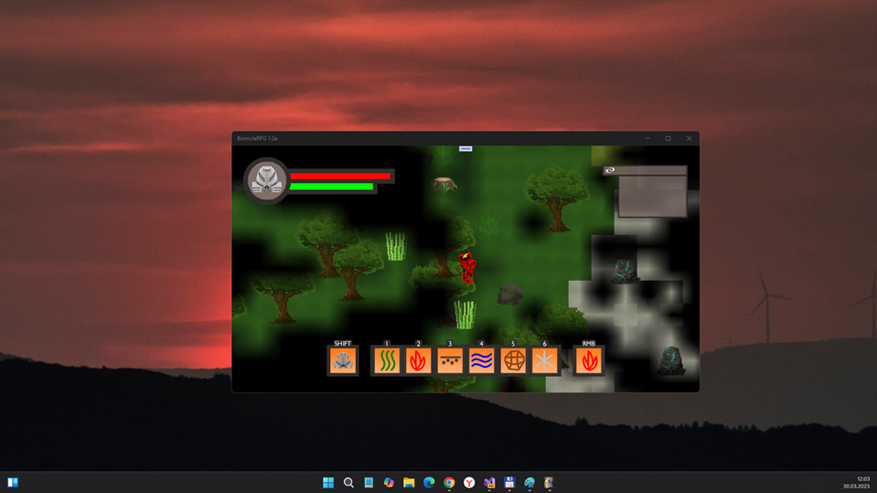
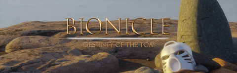

# BionicleRPG 1.0-prealpha - main branch 

## About 
" BIONICLE: Destiny of the Toa is a 2D top-down RPG with procedurally generated islands and dungeons. Experience the infinite possibilities when it comes to world exploration, start a new game, and get a new world every time, or save the game to reload and explore your absolute favorite world again and again.

Use mask powers to find new ways to explore the world around you. Visit all the different biomes, either by yourself or use the map if you ever get lost.

Help the Matoran villagers by accepting quests. Venture out into the world to gather materials, clear dungeons or defeat enemies." 

## Controls
- WASD: Move
- LMB: Normal attack
- RMB: Elemental attack
- Left Shift: Mask power
- 1-6: Change character / mask
- M: Map
- F: Interact

## Screenshots

## Tech details
- Early bird. I plan to use this thing as template ("sketch") to simplify some adventure game dev in future:)
- UWP app : Min Win. SDK is 10240, Main Win. SDK is 19041  

## ToDo
- Realize some more complex game process ;)

## Reference(s)
https://ripofirm.itch.io/bionicle-destiny-of-the-toa Original project

## .
As is. No support. DIY. Learn purposes only.

## ..
[m][e] March 2025

